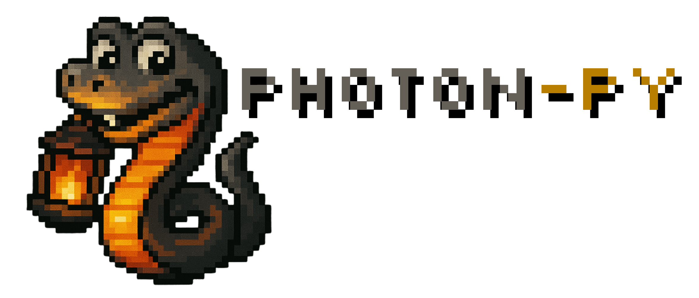

  

A Wrapper on some computer vision methods in order to precisely track light and darkness in a image or video.

## Problem to be Addressed:
High complexity in converting images and videos into machine-readable data, in an open-source manner.

## Objectives
To abstract the complexity of analyzing videos and images for training machines to recognize planes and lighting levels. 
(AI or inverse kinematics for movement in robotics)
To seek harmony between classic techniques such as Laplacian, Canny, Sobel, Median, Bilateral filters, etc. 
In order to create a function called “robotEye()” that abstracts the connection with devices and has an algorithm useful in several applications.

## Specific Objectives:

- Measurement of brightness levels with fuzzy
- Surface recognition and mapping
- Encapsulation of pre- and post-processing methods of images
- Simplification of results in a simple GUI
- Application of linear algebra formulas for image processing (future implementation).
- Integration with cameras and application of filters in real time. (final objective)

## Filters used:
- Median Filter (noise reduction)
- Bilateral Filter (max. quality)
- Morphological: Opening and Closing.

## License

[MIT](https://choosealicense.com/licenses/mit/)
